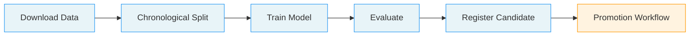
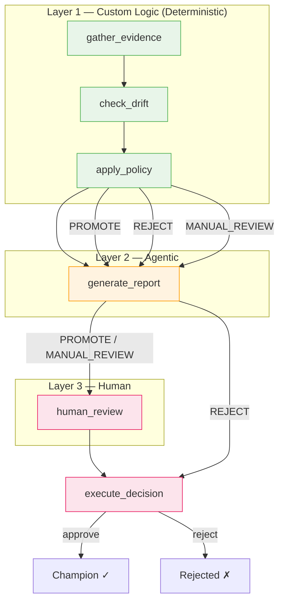

# HDB Resale Agentic MLOps

Notebook-first model training, evaluation, and governed promotion with MLflow, drift checks, deterministic policy gates, and explainer reports.

In Singapore, HDB (Housing & Development Board) flats make up nearly 80% of all housing. Prices vary widely by town, flat type, floor level, and remaining lease,making it a rich ML regression problem. This project predicts HDB resale prices with XGBoost, and uses an **agentic workflow** to decide whether a newly trained model is good enough to replace the current champion.

The key idea: **LLM investigates, but never decides.** A deterministic policy engine handles routing, a ReAct (Reasoning + Acting) agent builds the evidence report, and a human makes the final call.

## New to MLOps?

Start with the beginner walkthrough:

- [`docs/beginner-end-to-end-guide.md`](docs/beginner-end-to-end-guide.md): a detailed, beginner-friendly explanation of the objective, architecture, components, and full end-to-end flow, with diagrams.

## Architecture

The system closely follows these design patterns from the [Google Cloud agentic AI patterns guide](https://docs.cloud.google.com/architecture/choose-design-pattern-agentic-ai-system):

| Pattern | Role in This System |
|---|---|
| **Custom logic (Non-agentic)** | Deterministic actions in LangGraph and Python: gather evidence, run drift checks, apply the rule-based policy, and branch to auto-reject or human review |
| **Single-agent (ReAct)** | Explainer agent autonomously investigates model quality using 7 tools — metrics, segment comparison, drift, training history, and web search |
| **Human-in-the-loop** | LangGraph gathers the review payload, persists it as a review packet, and waits for human approval or override before the final registry action |

Tool calling happens in the ReAct explainer layer, not in the deterministic policy layer. The overall promotion workflow is mixed-pattern: deterministic routing first, then agentic report generation, then human approval or rejection.

### End-to-End Pipeline



### Promotion Workflow (Three-Layer Architecture)

When a candidate model is registered, the promotion workflow runs as a LangGraph state machine with six nodes across three layers:



**Why three layers?** The policy engine handles routing deterministically. The explainer step is intentionally non-deterministic because the ReAct agent chooses which tools to call and how to synthesize the evidence. **Obvious rejects** are auto-rejected after the report is generated, while promote and manual-review cases pause for human approval. The agent adds narrative and supporting context after the deterministic layer has already evaluated candidate-vs-champion performance, segmented regressions, and PSI/KS drift signals.

## How It Works

### 1. Data — Chronological Splits, Not Random

The dataset comes from [data.gov.sg](https://data.gov.sg/datasets/d_8b84c4ee58e3cfc0ece0d773c8ca6abc/view) where every HDB resale transaction from January 2017 onward is recorded. The data is then split **chronologically**: the most recent 12 months become the test set, the prior 12 months become validation, and the rest is training data.

Why not random splits? In production, models predict future prices from past data. A random split would leak future information into training and give misleadingly optimistic metrics.

### 2. Training — Notebook-First Paths from a Shared Core

An XGBoost regression pipeline fits on 8 features:

- **Categorical**: `town`, `flat_type`, `flat_model`, `storey_range`
- **Numeric**: `floor_area_sqm`, `flat_age_years`, `remaining_lease_years`, `storey_midpoint`

The same training logic now supports one public notebook and two internal enterprise notebook variants:

| Mode | Entry Point | How It Trains |
|------|-------------|---------------|
| **Local / Colab** | `hdb-resale-candidate-training-local-colab.ipynb` | Fits locally, logs to the configured MLflow tracking URI or a local SQLite fallback |
| **Enterprise direct job** | Internal enterprise notebook variant | Launches a SageMaker script-mode job, then logs notebook-side to the configured MLflow tracking URI or a local SQLite fallback |
| **Enterprise pipeline DAG** | Internal enterprise notebook variant | Defines and runs a SageMaker Pipeline (`PrepareData -> TrainCandidate -> EvaluateRegisterCandidate -> PolicyGate`), then continues the explainer + human review flow from the pipeline's frozen handoff |

The public repo ships only the local / Colab notebook. Internal users who need the enterprise notebook variants should refer to the MAESTRO internal docs for the notebook entrypoints and platform-specific setup. All flows import from the same `src/hdb_resale_mlops/` package, so the training and review logic is still shared.

### 3. Evaluation — Segmented Metrics, Not Just Overall Accuracy

Overall RMSE (Root Mean Squared Error) tells you how the model performs on average. But HDB prices vary tremendously, an executive flat in Kallang behaves nothing like a 3-room flat in Yishun. A candidate that improves overall RMSE while posting a much worse segmented RMSE than the current champion for a town or flat type is still a regression for that subgroup.

The evaluation layer computes RMSE and MAE (Mean Absolute Error) **per town** and **per flat type**. These segmented metrics flow all the way through to the policy engine, so a segmented regression in any group triggers a manual review.

> **Why RMSE?** RMSE is simple and widely understood, which makes it a reasonable default for a demo-scope project. In practice, MAPE (percentage error) or RMSLE (log-scale error) can be better choices for housing price data as MAPE is more intuitive when price ranges are wide, and RMSLE dampens the outsized influence of very expensive outliers. The policy engine and segmented checks are metric-agnostic in structure, so adopting a different primary metric would not change the workflow design.

### 4. Promotion — Policy Engine + Agent + Human

The three-layer promotion workflow runs after evaluation:

**Layer 1 — Custom logic (deterministic orchestration)** gathers evidence, runs drift checks, and applies hard rules:

| Check | Threshold | Outcome |
|-------|-----------|---------|
| Test RMSE exceeds absolute max | > $200,000 | `REJECT` |
| Test MAE exceeds absolute max | > $170,000 | `REJECT` |
| Overall RMSE regresses vs champion | > 10% worse | `REJECT` |
| Segmented RMSE regresses vs champion in any group | > 20% worse | `MANUAL_REVIEW` |
| Data drift detected (PSI or KS) | PSI > 0.2, KS p < 0.05 | `MANUAL_REVIEW` |
| All checks pass, no champion exists | — | `PROMOTE` |

Passing the PSI/KS drift checks only means the monitored features did not show a large distribution shift under those tests. It does not rule out concept drift or a segmented-specific performance regression, which is why segmented RMSE checks remain a separate policy input.

**Layer 2 — ReAct explainer agent** receives the policy verdict and autonomously investigates using 7 tools:

| Tool | What It Does |
|------|-------------|
| [`query_candidate_metrics`](src/hdb_resale_mlops/explainer.py) | Returns the candidate's overall test RMSE and MAE |
| [`query_champion_metrics`](src/hdb_resale_mlops/explainer.py) | Returns the current champion's metrics (or "no champion exists") |
| [`compare_segment_performance`](src/hdb_resale_mlops/explainer.py) | Per-segment RMSE deltas between candidate and champion, sorted by worst regression |
| [`check_drift_report`](src/hdb_resale_mlops/explainer.py) | PSI scores for categorical features, KS test results for numeric features |
| [`get_policy_verdict`](src/hdb_resale_mlops/explainer.py) | The deterministic policy decision with reasons and pass/fail details |
| [`get_training_history`](src/hdb_resale_mlops/explainer.py) | Metrics plus prior promotion outcomes from recent model versions |
| [`research_market_trends`](src/hdb_resale_mlops/explainer.py) | Web search for recent HDB market news and policy changes using Tavily, OpenAI native web search, or both (`MARKET_RESEARCH_PROVIDER`) |

The agent decides which tools to call, in what order, and how deep to investigate. It produces a structured report with **summary, evidence, risk flags, market context, and recommendation** but never makes the promote/reject decision itself.

**Layer 3 — Human review**: `PROMOTE` and `MANUAL_REVIEW` cases now persist a local review packet under `artifacts/promotion_reviews/` and mirror the same packet into the candidate MLflow run under `promotion_review/<review_id>/`. `REJECT` cases are still rejected automatically after the report is generated, but the saved review packet allows a later human override if needed.

### 5. Graceful Degradation

The system runs at every capability level:

| Missing | What Happens |
|---------|-------------|
| No `OPENAI_API_KEY` | Explainer produces a template-based report from raw evidence instead of using the LLM |
| No `TAVILY_API_KEY` | If `MARKET_RESEARCH_PROVIDER=auto` and `OPENAI_API_KEY` is set, market research uses OpenAI native web search; otherwise the market research tool is unavailable |
| No champion model | Policy applies only absolute thresholds and skips champion comparison |
| No drift data | Drift check returns neutral; workflow continues |
| Champion evidence or review persistence unavailable in MLflow | Policy blocks promotion and requires an explicit human override after the issue is resolved |

Promotion decisions are also written back to MLflow model-version tags so the registry shows the deterministic `policy_verdict`, `policy_reasons`, `decision_source`, `decision_timestamp`, optional `decision_reviewer`, and whether a reject was later overridden. The explainer now emits a first-class MLflow trace/span tree for each review, mirrors tool calls/results into compact child spans, links that trace back to the candidate run when the tracking store supports trace-to-run links, and logs the rendered report, structured payload, serialized tool trace, runtime metadata, and persisted review packet under `promotion_review/<review_id>/`. If you opt into `ENABLE_JUDGE_EVAL=true`, the workflow also logs advisory `judge_*` metrics and a `judge_evaluation.json` artifact alongside the review packet. When MLflow tracking is configured, failed review-artifact persistence now blocks the workflow instead of silently degrading.

## Project Structure

The repo is intentionally notebook-first. These are the main paths worth knowing:

- `hdb-resale-candidate-training-local-colab.ipynb`: the main public entrypoint for local or Colab runs
- `src/hdb_resale_mlops/`: shared package for data prep, feature engineering, training, evaluation, MLflow registration, drift checks, policy rules, and the promotion workflow
- `src/pipeline_steps/`: thin SageMaker processing-step wrappers used by the enterprise pipeline flow
- `tests/`: unit, workflow, and report-quality coverage, plus reusable golden scenarios
- `docs/`: supporting documentation, including the beginner end-to-end guide
- `pyproject.toml` and `.env.example`: local setup, dependency groups, and environment configuration

## Quick Start

### Fixture Demo (fastest way to inspect the agentic flow)

If you want to understand the promotion workflow without training a model first, replay one of the golden scenarios:

```bash
python3 -m venv .venv && source .venv/bin/activate
pip install --upgrade pip
pip install -e '.[agent,dev]'
make demo-list
make demo-scenario SCENARIO=manual_review_drift
```

This writes a demo report, review packet, and tool outputs under `artifacts/demo/<scenario>/` using the fixtures in `tests/fixtures/eval_scenarios/`.

### Local / Colab Edition (no AWS required)

[](https://colab.research.google.com/github/tengfone/hdb-resale-agentic-mlops/blob/main/hdb-resale-candidate-training-local-colab.ipynb)

Click the badge above, or run locally:

```bash
make install-notebook
source .venv/bin/activate
jupyter notebook hdb-resale-candidate-training-local-colab.ipynb
```

If you run the notebook from VS Code instead of the `jupyter` CLI, select the `.venv` kernel after `make install-notebook`; that target installs the package, `ipykernel`, and notebook support into the same environment.
When `mise` is installed, the Make targets prefer the repo-pinned Python from `.mise.toml` and will recreate `.venv` if it was built with a different interpreter.
When you open the notebook in Colab, the first notebook cell clones the repo under `/content/hdb-resale-agentic-mlops`, installs it in editable mode, and restarts the runtime once so NumPy/pandas reload cleanly. After the reconnect, run that bootstrap cell again and continue with the notebook. This keeps repo-root path discovery, local artifact paths, and `.env` loading aligned with the local notebook flow.

The notebook will:

1. Download the HDB resale dataset from data.gov.sg and cache it locally
2. Create chronological train/validation/test splits
3. Train an XGBoost model locally
4. Evaluate with overall and per-segment metrics
5. Log the run to MLflow, defaulting to local SQLite when `MLFLOW_TRACKING_URI` is unset, and register as `candidate`
6. Run the agentic promotion workflow, persist the review packet, and collect human approval or override

Browse logged runs afterwards with the default local fallback:

```bash
mlflow ui --backend-store-uri sqlite:///mlflow.db
```

<details>
<summary><strong>Enterprise Notebook Variants / SageMaker</strong></summary>

The enterprise notebook variants are maintained internally rather than published in this repo. Internal users can follow the MAESTRO internal docs for the actual notebook entrypoints and platform-specific setup. The shared SageMaker modules in this repo still back those flows.

From a SageMaker-managed Jupyter environment, the direct enterprise notebook variant will:

```bash
pip install '.[sagemaker,agent]'
```

1. Download the dataset via the data.gov.sg v1 download API and cache a CSV snapshot
2. Create chronological splits
3. Launch a SageMaker script-mode training job
4. Download the trained model artifact from S3
5. Evaluate locally
6. Log the run, segment artifacts, and model to MLflow
7. Register the model version and assign the `candidate` alias
8. Run the agentic promotion workflow

If `MLFLOW_TRACKING_URI` is unset, the notebook now falls back to the same local SQLite-backed MLflow store as the Local / Colab edition: `sqlite:///mlflow.db`.

The enterprise pipeline notebook variant will:

1. Define and upsert a SageMaker Pipeline DAG
2. Run `PrepareData -> TrainCandidate -> EvaluateRegisterCandidate -> PolicyGate`
3. Download `registration.json`, `policy_verdict.json`, and `review_handoff.json` from S3
4. Continue the notebook-side explainer + human review flow from the frozen handoff

Pipeline mode requires an external `MLFLOW_TRACKING_URI`. The local SQLite fallback is not valid for the enterprise pipeline variant because each SageMaker Pipeline step runs in a separate isolated job.

See `.env.example` for a ready-to-copy template, or expand below:

<details>
<summary>Full enterprise environment variables</summary>

```bash
# Required
export MLFLOW_TRACKING_URI=https://<your-mlflow-host>
export MLFLOW_MODEL_NAME=hdb-resale-price-regressor

# Optional — SageMaker
export AWS_REGION=ap-southeast-1
export SAGEMAKER_ROLE_ARN=arn:aws:iam::<account-id>:role/<role-name>
export S3_BUCKET=<bucket-name>

# Optional — MLflow auth
export MLFLOW_TRACKING_USERNAME=<username>
export MLFLOW_TRACKING_PASSWORD=<password>
export MLFLOW_EXPERIMENT_NAME=hdb-resale-candidate

# Optional — Agentic workflow
export OPENAI_API_KEY=<key>
export OPENAI_MODEL=gpt-5-nano
export OPENAI_BASE_URL=https://<openai-compatible-host>/v1
export ENABLE_JUDGE_EVAL=true   # optional: advisory report-quality scoring
export MARKET_RESEARCH_PROVIDER=auto
export OPENAI_WEB_SEARCH_MODEL=gpt-5-nano
export OPENAI_JUDGE_MODEL=gpt-5-mini
export TAVILY_API_KEY=<key>
export DATA_GOV_API_KEY=<key>   # optional: forwarded as x-api-key for higher data.gov.sg rate limits

# Optional — Network (isolated environments)
export MAESTRO_HTTP_PROXY=http://<proxy-host>:<port>
export MAESTRO_HTTPS_PROXY=http://<proxy-host>:<port>
export TRAINING_PIP_INDEX_URL=https://<pypi-mirror>/simple/
```

Inside SageMaker notebooks, the code defaults to `sagemaker.Session()`, `sagemaker.get_execution_role()`, and `sagemaker_session.default_bucket()` — only set the overrides if you need different values.
If your enterprise notebook environment needs an outbound proxy, set `MAESTRO_HTTP_PROXY` and `MAESTRO_HTTPS_PROXY` in `.env` or the notebook environment before running the setup cell. The data.gov.sg downloader reads those values directly, and the Tavily path applies them only around the Tavily request so AWS/SageMaker setup in the notebook is not forced through that proxy.

The SageMaker path uses the scikit-learn `1.4-2` container (Python 3.10). NumPy, pandas, SciPy, and scikit-learn are provided by that image, so `src/requirements.txt` only installs extra training dependencies. The pipeline's processing steps use a separate `src/pipeline_steps/requirements.txt` so SageMaker framework processors can install the MLflow and XGBoost extras they need without changing the training-container contract.

If `OPENAI_BASE_URL` is unset, the OpenAI client uses the official OpenAI endpoint. `OPENAI_API_BASE` is also accepted as a compatibility alias for `OPENAI_BASE_URL`. When you do set a base URL, it must support OpenAI Chat Completions and tool calling closely enough for `langchain_openai`; some proxies return non-standard payloads and will force the explainer onto the template fallback path. The native judge path also uses LangChain/OpenAI directly, but it now reuses the same `OPENAI_API_KEY` and `OPENAI_BASE_URL` / `OPENAI_API_BASE` settings as the explainer. `OPENAI_JUDGE_MODEL` is only a plain model-name override for that second advisory LLM call. `MARKET_RESEARCH_PROVIDER` accepts `auto`, `tavily`, `openai`, `both`, or `none`; `auto` prefers Tavily when `TAVILY_API_KEY` is present and otherwise falls back to OpenAI native web search. `OPENAI_WEB_SEARCH_MODEL` optionally overrides the model used for the OpenAI native search call and defaults to `OPENAI_MODEL`.

</details>

</details>

## Environment

All defaults work out of the box for open-source mode. Optionally configure:

```bash
export OPENAI_API_KEY=<key>            # enables LLM explainer agent
export OPENAI_MODEL=gpt-5-nano       # default if unset
export ENABLE_JUDGE_EVAL=true        # optional advisory judge scoring; logs judge_* metrics to MLflow
export MARKET_RESEARCH_PROVIDER=auto  # auto | tavily | openai | both | none
export OPENAI_WEB_SEARCH_MODEL=gpt-5-nano  # optional override for OpenAI native web search
export OPENAI_JUDGE_MODEL=gpt-5-mini  # optional advisory judge model; reuses the main OpenAI connection
export TAVILY_API_KEY=<key>            # enables Tavily market research when provider includes tavily
export DATA_GOV_API_KEY=<key>          # optional: sent to data.gov.sg as x-api-key
export MODEL_REVIEWER=<name>          # optional reviewer name for MLflow audit tags
```

See `.env.example` for the combined local and enterprise template. Local / Colab users can ignore the enterprise-only SageMaker and proxy settings in that file.

When you run the notebook or import `hdb_resale_mlops` locally, the package now auto-loads a repo-local `.env` file if one exists. Existing process environment variables still win. When you launch a SageMaker training job or SageMaker Pipeline from an enterprise notebook variant, the repo's known project env vars are forwarded into the remote jobs so local `.env`-backed settings carry through without extra wiring.

`ENABLE_JUDGE_EVAL` is intentionally opt-in so the tutorial does not add a second LLM call unless you want it. When enabled, the judge score is advisory only: it shows up in MLflow metrics/artifacts, but it does not change the deterministic policy verdict or the final human approval step. The repo's `.[agent]` extra includes the LangChain/OpenAI runtime used by both the explainer and the native judge path.

`DATA_GOV_API_KEY` is optional, but when present the downloader forwards it to data.gov.sg as an `x-api-key` header. This is useful in environments that need authenticated higher-rate dataset access.

## Dependencies

```bash
pip install .                      # base (local training + local MLflow)
pip install '.[notebook]'          # + local notebook kernel/server support
pip install '.[agent]'             # + agentic workflow and optional judge runtime (langchain, langgraph, tavily)
pip install '.[agent,notebook]'    # local notebook workflow + agentic promotion review
pip install '.[sagemaker]'         # + enterprise training (boto3, sagemaker SDK)
pip install '.[sagemaker,agent]'   # enterprise + agentic workflow
pip install '.[all]'               # everything
```

## Key Design Decisions

**Why the LLM is an investigator, not a decision-maker.** LLMs can hallucinate metrics or fabricate reasons for promotion. By restricting the agent to a tool-using investigator role with an explicit system prompt ("Your report does NOT make the final promote/reject decision"), the architecture keeps the LLM where it excels. Synthesis, explanation, and autonomous evidence gathering while keeping policy routing explicit, testable, and auditable.

**Why policy is deterministic Python, not a config file.** Policy thresholds are code, versioned alongside the model training logic. When a threshold changes, the diff is a one-line Python change with a clear commit history. Config files hide decisions. Code makes them explicit and testable (see `tests/test_policy.py`).

**Why per-segment metrics matter.** A model that improves overall RMSE by 5% but has a 3-room-flat segment RMSE that is 30% worse than the current champion is still a regression for 3-room flat owners. Segmented metrics by `town` and `flat_type` are logged as MLflow artifacts and flow through to the policy engine, so regressions in any subgroup trigger a manual review before promotion.

**Why drift blocks automatic promotion but does not force an immediate reject.** Distribution shifts between training and test data (e.g., post-COVID market resets, new BTO launches) are flagged via PSI (categorical) and KS tests (numeric). Those tests are only one view of risk: passing them does not prove there is no concept drift, and failing them does not by itself prove the candidate is unusable. With the current default policy (`drift_blocks_promotion=True`), detected drift stops the workflow from auto-promoting and routes the candidate to `MANUAL_REVIEW` unless some harder reject condition already failed. Segmented RMSE regressions are evaluated separately for exactly this reason, so the policy can catch subgroup failures even when PSI/KS stay below threshold.

**Why notebooks are the execution path.** In a notebook-first MLOps workflow, the notebook is the reproducible record of an experiment. Every run is a top-to-bottom execution: data download, training, evaluation, promotion decision. This makes the workflow auditable and approachable for data scientists who are not DevOps engineers.

## Tests

The test strategy follows the same broad shape recommended in Google's agent evaluation docs: check both the agent's **trajectory/tool use** and the **final response**, and keep the fast deterministic checks separate from the heavier scenario-level evals. It is not ADK-native: this repo does not use `adk eval` or ADK evalset formats, does not yet include user-simulation evals, and only partially covers trajectory scoring for real autonomous runs. See the [Google ADK evaluation guide](https://google.github.io/adk-docs/evaluate/).

```bash
make test
```

`make test` bootstraps `.venv`, reuses an existing working venv when possible, installs the package in editable mode with agent and dev extras when needed, and runs the core local suite with `unittest`. The opt-in LLM-as-a-judge checks are excluded from this default target even if `OPENAI_API_KEY` is set.

### What the tests are doing

| Test layer | Main files | What it verifies |
|---|---|---|
| **Deterministic module checks** | `tests/test_data.py`, `tests/test_features.py`, `tests/test_evaluation.py`, `tests/test_drift.py`, `tests/test_comparison.py`, `tests/test_policy.py`, `tests/test_mlflow_registry.py`, `tests/test_env.py`, `tests/test_sagemaker_job.py`, `tests/test_local_training.py` | Time-based splits stay chronological, feature engineering keeps the expected schema, evaluation math is correct, drift calculations and champion deltas are computed correctly, MLflow registry writes the right tags/artifacts, and notebook/SageMaker env wiring behaves predictably. |
| **Tier 1 agent tool tests** | `tests/test_explainer_tools.py`, `tests/test_explainer.py` | Each explainer tool returns stable text/JSON without needing a live LLM, the fallback report path works when agent dependencies are missing, and tool traces / metadata stay structured. |
| **Tier 2 scenario + workflow integration** | `tests/test_explainer_integration.py`, `tests/test_promotion_workflow.py`, `tests/test_workflow_integration.py`, `tests/test_demo.py` | Golden scenarios exercise the real tool surface, confirm the expected evidence appears in reports, verify LangGraph node routing, and prove the human-review flow pauses, resumes, auto-rejects, and persists review packets correctly. |
| **Workflow alignment guardrails** | `tests/test_notebook_alignment.py`, `tests/test_smoke.py` | The package schema still matches notebook expectations and the prepared feature frame stays aligned with the documented workflow. |
| **Tier 3 report-quality evaluation** | `tests/test_report_quality.py`, `tests/test_eval_judge.py` | Template and LLM-generated reports are checked for required sections and, when explicitly enabled, scored for completeness, accuracy, actionability, and safety with an LLM judge. |

### Golden scenarios

The JSON files under `tests/fixtures/eval_scenarios/` are the repo's lightweight eval set. Each fixture captures a known promotion situation, including the candidate metrics, optional champion evidence, drift report, policy verdict, and report expectations.

Those fixtures are reused in three places:

- `tests/test_explainer_integration.py` checks that the agent tools can produce the expected evidence for each scenario.
- `tests/test_workflow_integration.py` checks that the graph follows the correct path for each scenario, including human-review interruptions.
- `make demo-scenario` turns the same scenario into a readable review packet under `artifacts/demo/<scenario>/`.

That reuse is intentional: the same golden scenarios explain the workflow to humans, protect the code in CI, and provide stable examples for notebook/blog demos.

For report-quality checks:

```bash
make test-agent-llm
make test-report-template
make test-report-llm
```

`make test-agent-llm` is the smallest live LLM smoke test: it exercises the explainer agent itself on one golden scenario and verifies the run stays off the template fallback path. `make test-report-template` runs only the non-LLM structure checks for template reports. `make test-report-llm` is the explicit opt-in path for the judge-backed evaluations and sets `RUN_LLM_REPORT_QUALITY_TESTS=1` for that run.

In practice:

- `make test` is the fast local confidence check for code and workflow behavior.
- `make test-agent-llm` checks that the live explainer agent can produce a real report with the current LLM credentials and endpoint settings.
- `make test-report-template` checks the final report structure without paying for model calls.
- `make test-report-llm` is the heavier quality gate for the final narrative output and also exercises the native judge configuration.

For fixture-driven demos:

```bash
make demo-list
make demo-scenario SCENARIO=promote_no_champion
```

To reset local generated state:

```bash
make clean      # remove cached data, artifacts, local MLflow DB/runs, coverage/build output, Python caches
make clean-all  # same, plus .venv
```

The test suite covers policy engine routing (all three verdict paths), drift calculation (PSI and KS), champion comparison logic, explainer fallback behavior, native LangChain/OpenAI-backed report-quality judging, and promotion workflow integration with mocked dependencies.
