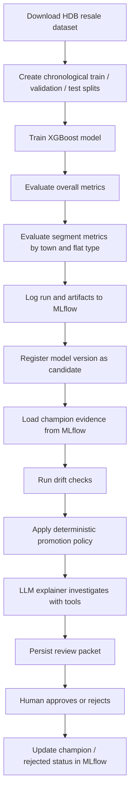
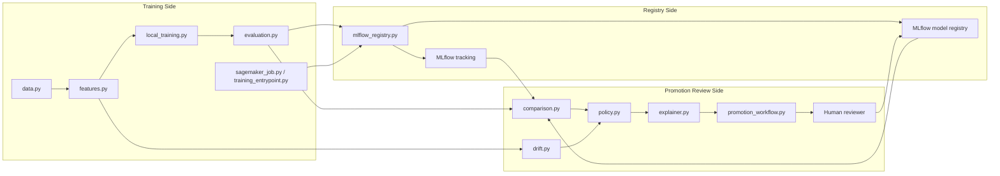
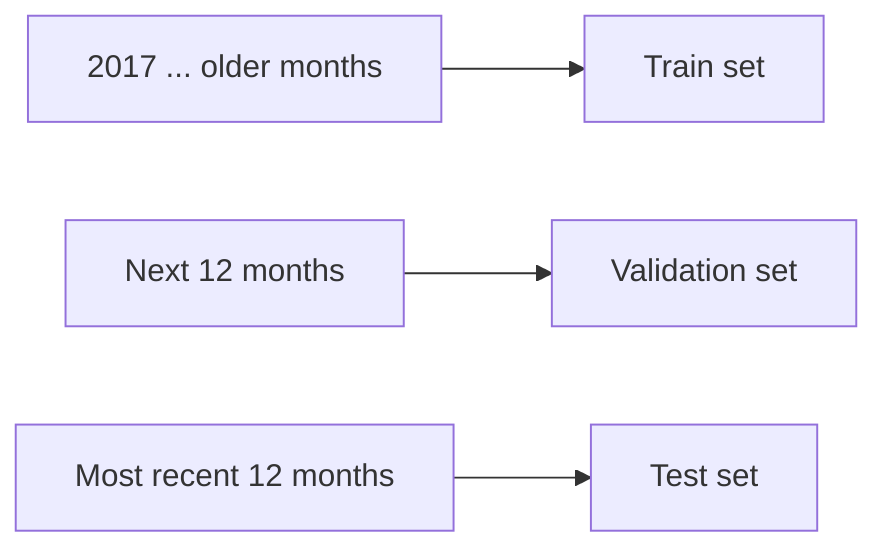
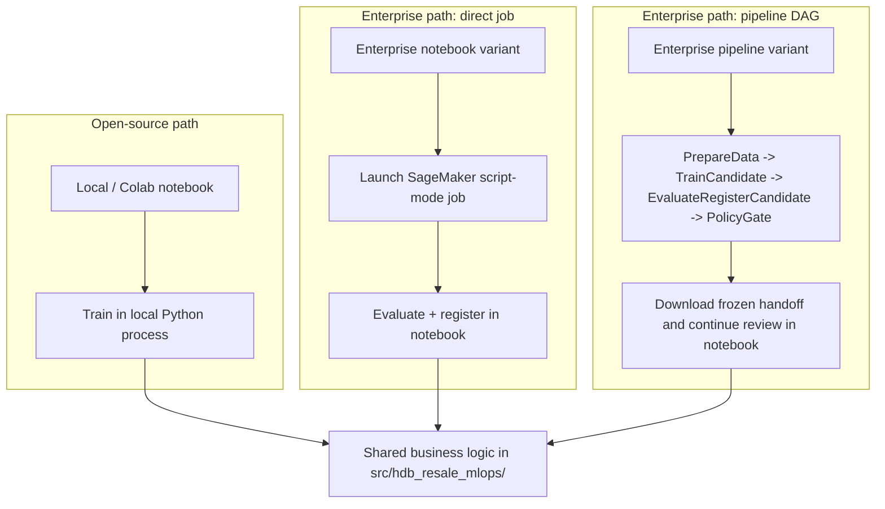
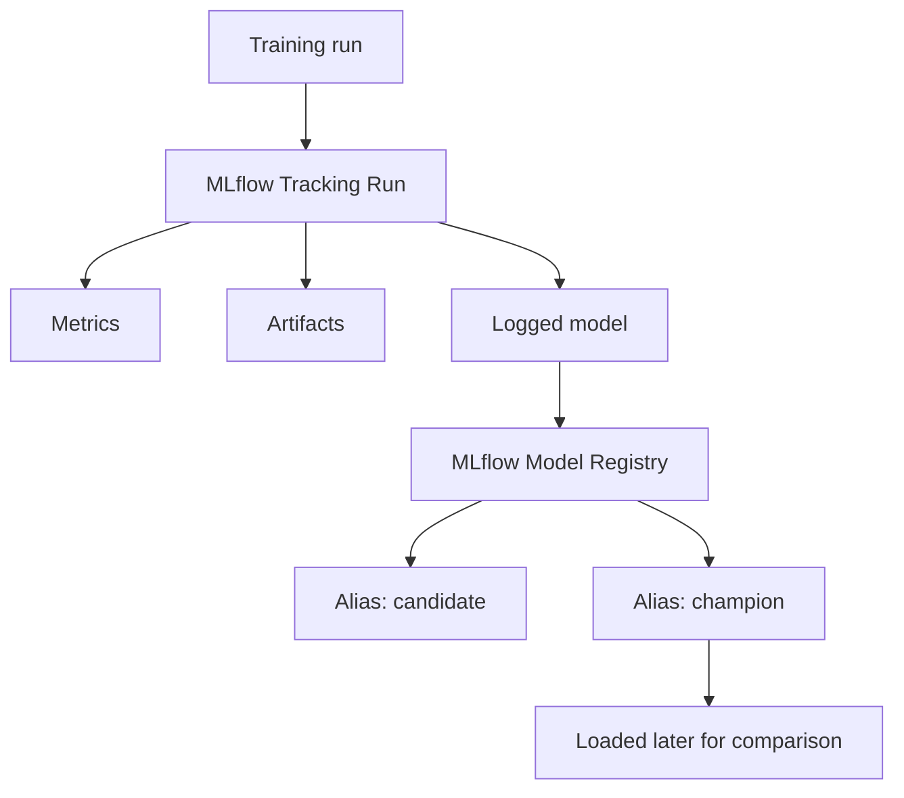
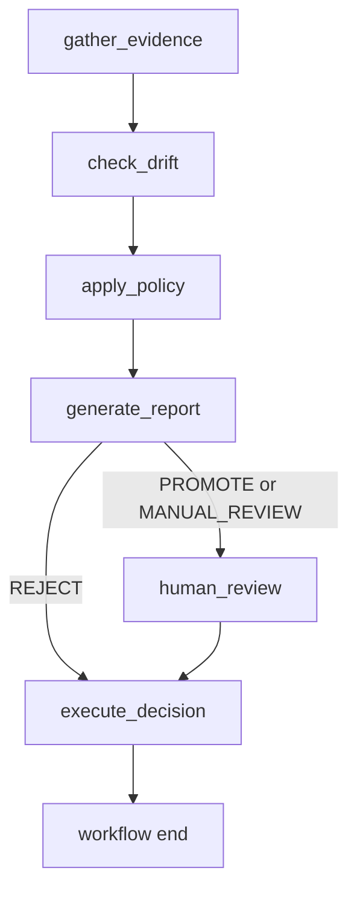
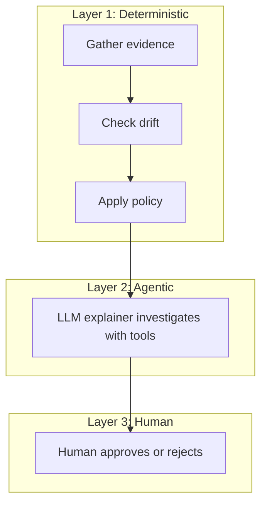
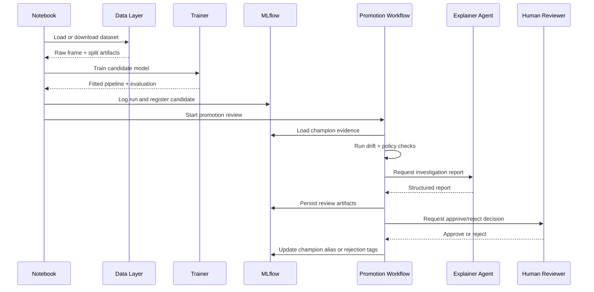
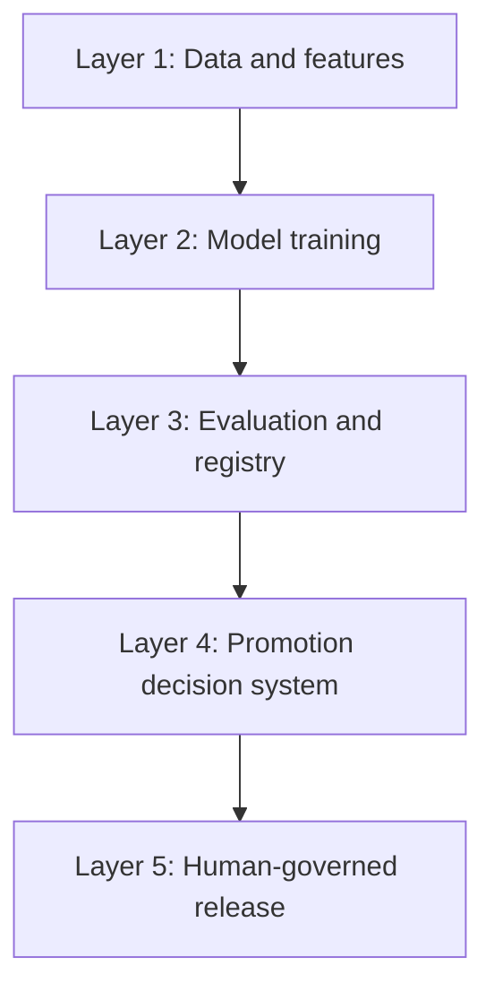

# Beginner Guide: End-to-End MLOps with an Agentic Promotion Workflow

This guide explains the whole project from first principles.

It is written for a beginner in MLOps who wants to understand:

- what problem this repo solves
- why each component exists
- how the pieces fit together
- what makes the workflow "agentic"
- how to run it yourself

If you only remember one idea from this guide, remember this:

> This project does not use an LLM to decide whether a model is good.
> It uses an LLM to investigate and explain, while deterministic code and a human control the final promotion decision.

---

## Table of Contents

1. [What This Project Is Trying to Do](#what-this-project-is-trying-to-do)
2. [What "MLOps" Means in This Repo](#what-mlops-means-in-this-repo)
3. [The Big Picture](#the-big-picture)
4. [The End-to-End Flow in Plain English](#the-end-to-end-flow-in-plain-english)
5. [Core Concepts You Should Know First](#core-concepts-you-should-know-first)
6. [Project Structure and What Each File Does](#project-structure-and-what-each-file-does)
7. [Detailed Walkthrough of Each Stage](#detailed-walkthrough-of-each-stage)
8. [How the Agentic Promotion Review Works](#how-the-agentic-promotion-review-works)
9. [How to Run the Project as a Beginner](#how-to-run-the-project-as-a-beginner)
10. [What You Learn from This Repo](#what-you-learn-from-this-repo)
11. [Common Questions Beginners Usually Have](#common-questions-beginners-usually-have)
12. [Suggested Learning Path](#suggested-learning-path)

---

## What This Project Is Trying to Do

The project predicts **HDB resale prices** in Singapore using a machine learning model.

But the project is not only about training a model.

It is about building the system around the model:

- getting the data
- splitting it correctly
- training consistently
- evaluating it carefully
- registering versions in MLflow
- comparing a new model against the current best model
- checking for drift
- applying policy rules
- generating an explanation report
- letting a human approve or reject promotion

That full system is the MLOps part.

### The business-style objective

The repo treats model promotion as a controlled release process.

Instead of saying:

> "The latest model trained successfully, so let us deploy it."

it says:

> "The latest model is only a **candidate**. It must prove it is good enough before it becomes the **champion**."

That is the central idea of the whole repository.

---

## What "MLOps" Means in This Repo

Many beginners think MLOps means "use Docker, Kubernetes, CI/CD, and cloud services."

That is only part of the story.

In this repo, MLOps means:

1. Treat the model as a managed product, not just a notebook experiment.
2. Make training and evaluation reproducible.
3. Track model versions and metrics in a registry.
4. Promote models using rules, evidence, and review instead of intuition.
5. Keep the workflow auditable.

This repo is intentionally **not** trying to be a huge enterprise platform.
It is trying to teach the core ideas in a concrete, understandable way.

---

## The Big Picture

Here is the entire system at a high level:



### A more architectural view



---

## The End-to-End Flow in Plain English

If you run the project from start to finish, this is what happens:

1. The system downloads the resale dataset from data.gov.sg.
2. It creates a **time-based split**:
   - older rows for training
   - the next 12 months for validation
   - the most recent 12 months for testing
3. It trains an `XGBRegressor`.
4. It evaluates the model:
   - overall RMSE and MAE
   - segment RMSE and MAE by `town`
   - segment RMSE and MAE by `flat_type`
5. It logs the run and artifacts to MLflow.
6. It registers the model in the MLflow Model Registry and marks it as the active `candidate`.
7. It loads the current `champion` model from MLflow if one exists.
8. It compares the candidate to the champion.
9. It checks whether the data distribution has drifted.
10. It applies a deterministic policy:
    - maybe reject
    - maybe request manual review
    - maybe allow promotion
11. An explainer agent investigates and writes a report.
12. A human reviews the report.
13. If approved, the candidate becomes the new `champion`.
14. If rejected, the version is tagged as rejected with reasons.

---

## Core Concepts You Should Know First

Before looking at files, make sure these terms are clear.

### Candidate model

A newly trained model that is being considered for promotion.

It is **not** automatically the best model.

### Champion model

The currently accepted best model in the registry.

When a new model is trained, the question becomes:

> Is this candidate good enough to replace the champion?

### Model Registry

A system for storing model versions and metadata.

In this project, the registry is **MLflow Model Registry**.

### Metrics

Numbers that measure model quality.

This project uses:

- RMSE: root mean squared error
- MAE: mean absolute error

### Segment metrics

Metrics broken down by subgroup.

Example:

- performance in `ANG MO KIO`
- performance for `4 ROOM`

This matters because a model can improve overall while quietly getting worse for important groups.

### Drift

Drift means the data distribution changed.

Example:

- certain towns appear more often now
- flat sizes or lease patterns shift

Even if accuracy looks acceptable, drift can be a warning sign.

### Policy engine

A deterministic set of rules that decides the route:

- `PROMOTE`
- `REJECT`
- `MANUAL_REVIEW`

### Agentic workflow

Here, "agentic" means the LLM can use tools to investigate evidence on its own.

It does **not** mean the LLM is in charge of the decision.

---

## Project Structure and What Each File Does

This section is the map of the repo.

### Notebooks

- [`hdb-resale-candidate-training-local-colab.ipynb`](../hdb-resale-candidate-training-local-colab.ipynb)
  - Local / Colab notebook.
  - Trains locally.
  - Best starting point for a beginner.

- Enterprise notebook variants (maintained internally)
  - One internal variant launches direct SageMaker script-mode training jobs.
  - Another internal variant defines and runs a SageMaker Pipeline DAG.
  - Internal users should refer to the MAESTRO internal docs for those notebook entrypoints.

### Shared package modules

#### Environment and configuration

- [`src/hdb_resale_mlops/config.py`](../src/hdb_resale_mlops/config.py)
  - Reads environment variables.
  - Builds the runtime configuration.
  - Knows where local folders live.

- [`src/hdb_resale_mlops/env.py`](../src/hdb_resale_mlops/env.py)
  - Loads a local `.env` file.
  - Forwards selected environment variables into SageMaker jobs.

#### Data and feature preparation

- [`src/hdb_resale_mlops/data.py`](../src/hdb_resale_mlops/data.py)
  - Downloads the raw dataset.
  - Caches it locally.
  - Creates chronological train/validation/test splits.
  - Persists split CSV files.

- [`src/hdb_resale_mlops/features.py`](../src/hdb_resale_mlops/features.py)
  - Defines feature columns.
  - Parses lease and storey strings into numeric values.
  - Builds preprocessing and training pipelines.

#### Training and evaluation

- [`src/hdb_resale_mlops/local_training.py`](../src/hdb_resale_mlops/local_training.py)
  - Shared local training core.
  - Fits the model and evaluates validation data.

- [`src/hdb_resale_mlops/evaluation.py`](../src/hdb_resale_mlops/evaluation.py)
  - Computes overall metrics.
  - Builds per-segment metric tables.

- [`src/hdb_resale_mlops/training_entrypoint.py`](../src/hdb_resale_mlops/training_entrypoint.py)
  - Script-mode training code used inside the SageMaker container.

- [`src/hdb_resale_mlops/sagemaker_job.py`](../src/hdb_resale_mlops/sagemaker_job.py)
  - Uploads split data to S3.
  - Launches SageMaker training.
  - Downloads the trained artifact back to local storage.

- [`src/hdb_resale_mlops/sagemaker_pipeline.py`](../src/hdb_resale_mlops/sagemaker_pipeline.py)
  - Builds the SageMaker Pipeline DAG.
  - Defines the notebook-facing handoff artifacts downloaded after a pipeline run.

- [`src/pipeline_steps/`](../src/pipeline_steps/)
  - Thin SageMaker processing-step entrypoints.
  - Keeps the pipeline-step logic aligned with the shared package code.

#### Registry and model lifecycle

- [`src/hdb_resale_mlops/mlflow_registry.py`](../src/hdb_resale_mlops/mlflow_registry.py)
  - Configures MLflow.
  - Logs metrics and artifacts.
  - Registers models.
  - Sets aliases like `candidate` and `champion`.
  - Persists review packets to MLflow artifacts.

#### Promotion workflow logic

- [`src/hdb_resale_mlops/comparison.py`](../src/hdb_resale_mlops/comparison.py)
  - Compares candidate metrics vs champion metrics.
  - Builds overall and segment deltas.

- [`src/hdb_resale_mlops/drift.py`](../src/hdb_resale_mlops/drift.py)
  - Detects categorical drift with PSI.
  - Detects numeric drift with KS tests.

- [`src/hdb_resale_mlops/policy.py`](../src/hdb_resale_mlops/policy.py)
  - Contains the deterministic promotion rules.

- [`src/hdb_resale_mlops/explainer.py`](../src/hdb_resale_mlops/explainer.py)
  - Builds and runs the LLM explainer agent.
  - Defines the tools the agent can use.
  - Falls back to a template report if no LLM is available.

- [`src/hdb_resale_mlops/promotion_workflow.py`](../src/hdb_resale_mlops/promotion_workflow.py)
  - Orchestrates the full review flow with LangGraph.
  - Connects evidence gathering, drift, policy, reporting, and human approval.

#### Supporting utilities

- [`src/hdb_resale_mlops/eval_judge.py`](../src/hdb_resale_mlops/eval_judge.py)
  - Optional native LangChain/OpenAI "LLM-as-a-judge" scoring for report quality.
  - This is advisory only.

- [`src/hdb_resale_mlops/demo.py`](../src/hdb_resale_mlops/demo.py)
  - Replays fixed demo scenarios without retraining.
  - Great for learning the workflow quickly.

- [`src/hdb_resale_mlops/tabular_state.py`](../src/hdb_resale_mlops/tabular_state.py)
  - Converts DataFrames into safe serializable forms for workflow state.

- [`src/train.py`](../src/train.py)
  - Tiny SageMaker entrypoint wrapper.

### Tests

The `tests/` directory is important because it shows how the system is supposed to behave.

The test strategy is intentionally layered.

This mirrors the general idea in [Google's agent evaluation guidance](https://google.github.io/adk-docs/evaluate/):

- test the deterministic parts directly
- test the agent tool path or "trajectory"
- test the final report output separately

In this repo, that becomes:

- [`tests/test_data.py`](../tests/test_data.py), [`tests/test_features.py`](../tests/test_features.py), [`tests/test_evaluation.py`](../tests/test_evaluation.py), [`tests/test_policy.py`](../tests/test_policy.py), [`tests/test_drift.py`](../tests/test_drift.py), [`tests/test_comparison.py`](../tests/test_comparison.py)
  - These are the fast deterministic checks.
  - They prove the time split, feature schema, metrics math, drift logic, champion comparison, and policy thresholds are correct before any LLM is involved.

- [`tests/test_explainer_tools.py`](../tests/test_explainer_tools.py)
  - Tier 1 agent tests.
  - They check each explainer tool in isolation, for example:
    - candidate metrics tool returns valid JSON
    - segment comparison tool sorts the worst regressions correctly
    - drift tool reports PSI and KS results in the expected structure
  - This keeps the agent's tool contract stable.

- [`tests/test_explainer_integration.py`](../tests/test_explainer_integration.py)
  - Tier 2 agent tests.
  - It uses the real tool objects plus golden scenarios, but without depending on an actual LLM decision loop.
  - The point is to verify that the evidence surface is factual and that a report assembled from those tool outputs contains the required content.

- [`tests/test_promotion_workflow.py`](../tests/test_promotion_workflow.py) and [`tests/test_workflow_integration.py`](../tests/test_workflow_integration.py)
  - These test the LangGraph promotion workflow itself.
  - They check routing across `PROMOTE`, `REJECT`, and `MANUAL_REVIEW`.
  - They also verify the human-review pause/resume behavior, auto-reject path, persisted review packets, and final MLflow registry actions.

- [`tests/test_report_quality.py`](../tests/test_report_quality.py)
  - Tier 3 evaluation tests.
  - First it checks that every report has the required sections.
  - Then, only when explicitly enabled, it uses an LLM judge to score report quality for completeness, accuracy, actionability, and safety.

- [`tests/test_notebook_alignment.py`](../tests/test_notebook_alignment.py) and [`tests/test_smoke.py`](../tests/test_smoke.py)
  - These are guardrail tests.
  - They make sure the package modules and notebook workflow stay aligned as the repo evolves.

### Fixtures

- [`tests/fixtures/eval_scenarios/`](../tests/fixtures/eval_scenarios)
  - Prebuilt golden review scenarios such as:
    - promote
    - reject
    - drift-triggered manual review
    - segment regression manual review

These are useful because they let you study the promotion logic without waiting for a real training run.

They are also reused across the repo:

- the explainer integration tests use them
- the workflow integration tests use them
- the demo command uses them to generate example review packets

So you can think of them as a small, hand-crafted eval set for the agentic promotion system.

---

## Detailed Walkthrough of Each Stage

### 1. Data ingestion

The first stage is handled by [`data.py`](../src/hdb_resale_mlops/data.py).

#### What it does

- calls the data.gov.sg download API
- polls until the CSV is ready
- downloads the CSV snapshot
- stores metadata such as:
  - dataset id
  - source URL
  - pull timestamp
  - record count

#### Why it matters

In many beginner projects, data is manually downloaded once and forgotten.

That is fine for a quick experiment, but not for an MLOps workflow.

Here, data ingestion is treated as a repeatable system step.

#### Beginner mental model

Think of `data.py` as the project’s "data loader and time-split manager."

#### Chronological splitting

This is one of the most important design choices in the repo.



Why not random split?

Because housing prices are time-sensitive.

If you randomly mix future rows into the training set, your evaluation becomes unrealistically optimistic.

This repo correctly treats the problem like a real forecasting-style supervised learning workflow:

- learn from the past
- validate on later data
- test on the most recent unseen data

---

### 2. Feature engineering

Feature engineering lives in [`features.py`](../src/hdb_resale_mlops/features.py).

#### Raw columns used

Categorical features:

- `town`
- `flat_type`
- `flat_model`
- `storey_range`

Numeric features:

- `floor_area_sqm`
- `flat_age_years`
- `remaining_lease_years`
- `storey_midpoint`

#### Derived features

The code turns messy raw fields into cleaner model inputs.

Examples:

- `remaining_lease` like `"75 years 10 months"` becomes a numeric value
- `storey_range` like `"10 TO 12"` becomes a midpoint like `11`
- `flat_age_years` is derived from sale date and lease commencement date

#### Why this matters

Real-world data is rarely ready for the model.

Feature engineering is the bridge between:

- human-readable columns
- model-friendly inputs

#### Preprocessing pipeline

The repo uses a scikit-learn `ColumnTransformer`:

- categorical columns -> one-hot encoding
- numeric columns -> passed through directly

This is good MLOps practice because preprocessing is bundled with the model pipeline.

That means when the model is saved, the transformation logic is saved with it.

---

### 3. Model training

Training uses `XGBRegressor`.

The repo exposes one public notebook plus two internal enterprise notebook variants for the same training-and-review flow.

#### The single most important clarification

There is only **one price-prediction model** in this repo:

- the tabular `XGBRegressor` pipeline in `features.py`

The other "models" you may notice are **LLM helpers**, not extra prediction models:

- the explainer LLM in `explainer.py`
- the optional report-quality judge LLM in `eval_judge.py`

So the repo is not doing "XGBoost plus several competing ML models."

It is doing:

1. one tabular regression model for price prediction
2. one optional LLM for writing a review report
3. one optional LLM for scoring the quality of that report

Only the first one predicts resale prices.

#### Local / notebook-first path

Implemented through [`local_training.py`](../src/hdb_resale_mlops/local_training.py).

This path:

- prepares the training frame
- builds the pipeline
- fits the model locally
- evaluates on validation data

Notebook call chain:

```text
hdb-resale-candidate-training-local-colab.ipynb
  -> data.py
  -> features.py
  -> local_training.py::train_locally()
  -> evaluation.py::evaluate_model()
  -> mlflow_registry.py::log_and_register_candidate_model()
  -> promotion_workflow.py::start_promotion_review()
  -> promotion_workflow.py::resume_promotion_review()   # after human input when required
```

#### Enterprise direct SageMaker job path

Implemented through:

- [`sagemaker_job.py`](../src/hdb_resale_mlops/sagemaker_job.py)
- [`training_entrypoint.py`](../src/hdb_resale_mlops/training_entrypoint.py)
- [`src/train.py`](../src/train.py)

This path:

- uploads the split data to S3
- launches a SageMaker job
- trains in a managed container
- downloads the model artifact
- evaluates locally afterward

Notebook call chain:

```text
internal enterprise direct-job notebook variant
  -> data.py
  -> persist split CSVs
  -> sagemaker_job.py::launch_training_job()
  -> src/train.py
  -> training_entrypoint.py::train()
  -> local_training.py::train_locally()
  -> SageMaker writes model.joblib
  -> sagemaker_job.py::download_model_artifact()
  -> evaluation.py::evaluate_model()
  -> mlflow_registry.py::log_and_register_candidate_model()
  -> promotion_workflow.py::start_promotion_review()
  -> promotion_workflow.py::resume_promotion_review()   # after human input when required
```

The important thing to notice is that even in the SageMaker path, the remote
container still ends up calling the same shared training core.

That is why the repo feels "indirect" when you first read it: the notebook is
orchestrating, but the real fit logic still lives in the shared package.

#### Enterprise SageMaker Pipeline DAG path

Implemented through:

- [`sagemaker_pipeline.py`](../src/hdb_resale_mlops/sagemaker_pipeline.py)
- [`src/pipeline_steps/`](../src/pipeline_steps/)

This path:

- defines a SageMaker Pipeline DAG in the notebook
- runs `PrepareData -> TrainCandidate -> EvaluateRegisterCandidate -> PolicyGate`
- downloads notebook-facing JSON outputs after the pipeline finishes
- continues the explainer + human review flow from a frozen handoff payload

Notebook call chain:

```text
internal enterprise pipeline notebook variant
  -> sagemaker_pipeline.py::build_sagemaker_pipeline()
  -> SageMaker Pipeline
     -> PrepareData
     -> TrainCandidate
     -> EvaluateRegisterCandidate
     -> PolicyGate
  -> download registration.json
  -> download policy_verdict.json
  -> download review_handoff.json
  -> promotion_workflow.py::start_promotion_review_from_handoff()
  -> promotion_workflow.py::resume_promotion_review()   # after human input when required
```

This path is different from the direct enterprise notebook variant in one important way:

- it does **not** use the local SQLite MLflow fallback
- it requires an external `MLFLOW_TRACKING_URI`
- it keeps the explainer + human review notebook-driven, but starts that phase from the pipeline's frozen `review_handoff.json`

#### MLflow behavior across the three execution modes

- Local / Colab notebook: defaults to `sqlite:///mlflow.db` when `MLFLOW_TRACKING_URI` is unset.
- Direct enterprise notebook variant: also falls back to `sqlite:///mlflow.db` when `MLFLOW_TRACKING_URI` is unset, because evaluation and MLflow logging happen notebook-side after SageMaker training finishes.
- Enterprise pipeline notebook variant: requires an external `MLFLOW_TRACKING_URI` because each pipeline step runs in a separate isolated job, so the local SQLite fallback does not apply.

#### Why there are three execution modes

This is a teaching strength of the repo.

It shows that the same business logic can run in:

- a simple local learning environment
- a notebook-driven SageMaker training job
- a notebook-driven SageMaker Pipeline DAG

#### Diagram: three execution modes, one shared codebase



---

### 4. Evaluation

Evaluation is handled by [`evaluation.py`](../src/hdb_resale_mlops/evaluation.py).

#### Overall metrics

The repo computes:

- RMSE
- MAE

These give a top-level sense of prediction quality.

#### Segment metrics

The repo also builds metric tables by:

- `town`
- `flat_type`

Each segment row contains:

- segment name
- count
- RMSE
- MAE
- mean actual price
- mean predicted price

#### Why segment metrics are a big deal

Suppose the candidate model improves overall RMSE slightly.

That sounds good, but what if:

- it gets much worse in Yishun
- or it performs badly for 3-room flats

That would matter in the real world.

This project teaches an important MLOps lesson:

> Average improvement is not always a safe improvement.

---

### 5. MLflow tracking and registry

MLflow integration is in [`mlflow_registry.py`](../src/hdb_resale_mlops/mlflow_registry.py).

This file is one of the most important ones in the repo.

#### What MLflow is doing here

MLflow is used for two related but different jobs:

1. **Tracking**
   - store run metrics
   - store artifacts
   - keep experiment history

2. **Registry**
   - store model versions
   - label versions with aliases like `candidate` and `champion`

#### What gets logged

For each run, the project logs:

- validation metrics
- test metrics
- prediction CSVs
- segment CSV/JSON artifacts
- dataset snapshot metadata
- split summary
- feature schema
- model artifact

#### Registry semantics

This repo uses aliases to represent lifecycle state:

- `candidate`
- `champion`

That is a clean beginner-friendly registry design because the meaning is obvious.

#### Diagram: how MLflow fits into the system



#### Why this matters in MLOps

Without a registry, a model is just a file.

With a registry, a model becomes a managed versioned object with:

- status
- metrics
- metadata
- history

---

### 6. Candidate vs champion comparison

Comparison logic lives in [`comparison.py`](../src/hdb_resale_mlops/comparison.py).

#### What it does

It compares:

- candidate overall metrics vs champion overall metrics
- candidate segment RMSE vs champion segment RMSE

It builds:

- overall metric deltas
- percentage deltas
- segment-level deltas

#### Why this matters

A candidate is not evaluated in isolation.

It is evaluated relative to:

- fixed quality thresholds
- the current champion

This is more realistic than saying "the RMSE is 150k, therefore the model is good."

The better question is:

> Is this model better than what we already trust?

---

### 7. Drift detection

Drift logic lives in [`drift.py`](../src/hdb_resale_mlops/drift.py).

#### What it checks

Categorical columns:

- PSI (Population Stability Index)

Numeric columns:

- KS test (Kolmogorov-Smirnov test)

#### What drift means here

The project compares the **training distribution** to the **test distribution** within the same run.

This can reveal shifts such as:

- new towns appearing more often
- floor area distribution changing
- lease distribution changing

#### Why drift is important

A model can have acceptable metrics today while the data is already changing underneath it.

Drift is not proof that the model is bad.

It is a signal that the environment may be changing.

#### Why drift does not automatically reject

This repo makes a subtle and good design choice:

- with the current default policy, `drift_blocks_promotion=True`, so drift blocks automatic promotion
- but drift alone does not mean the model must be rejected forever

Instead, drift contributes a `MANUAL_REVIEW` verdict unless some harder reject condition already failed.

That is more realistic than blindly rejecting everything.

---

### 8. Deterministic promotion policy

Policy logic lives in [`policy.py`](../src/hdb_resale_mlops/policy.py).

This file answers the question:

> Given the evidence, what route should this model take?

#### Possible decisions

- `PROMOTE`
- `REJECT`
- `MANUAL_REVIEW`

#### Current default rules

- reject if test RMSE is above the absolute maximum
- reject if test MAE is above the absolute maximum
- reject if overall RMSE regresses too much vs champion
- send to manual review if segment regressions exceed the allowed percentage
- send to manual review if drift is detected and no harder reject condition already failed
- promote only when all required checks pass

#### Why this is deterministic Python

The point is to make the decision:

- explicit
- testable
- auditable

This is crucial.

If the LLM made the decision directly, you would lose reliability and repeatability.

---

### 9. The explainer agent

The explainer is implemented in [`explainer.py`](../src/hdb_resale_mlops/explainer.py).

This is the "agentic" part of the project.

#### What the agent does

The agent receives a brief such as:

- the candidate version
- the policy verdict
- the reasons the policy flagged

Then it investigates by calling tools.

#### Tools available to the agent

Core tools:

- query candidate metrics
- query champion metrics
- compare segment performance
- check drift report
- get policy verdict
- get training history

Optional tool:

- research market trends

#### What the agent is **not** allowed to do

It is not allowed to make the final promote/reject decision.

Its job is to produce a structured report with:

- summary
- evidence
- risk flags
- market context
- recommendation for the human reviewer
- citations when external research is used

#### Why this is a good beginner pattern

This repo demonstrates a healthy way to use LLMs in MLOps:

- not as an oracle
- not as an uncontrolled decision-maker
- but as a tool-using analyst

#### Fallback behavior

If no OpenAI API key is available:

- the project still works
- it generates a deterministic template report instead

That is excellent for learning because the workflow does not collapse just because the LLM is unavailable.

---

### 10. The promotion workflow orchestrator

The overall workflow is implemented in [`promotion_workflow.py`](../src/hdb_resale_mlops/promotion_workflow.py).

This file ties everything together.

It uses **LangGraph** to model the review as a state machine.

#### Why use a workflow graph at all

Because promotion is not a single function call.

It is a series of dependent steps:

- gather evidence
- check drift
- apply policy
- generate report
- possibly wait for human input
- execute the final registry action

#### State machine diagram



#### What each node does

##### `gather_evidence`

- loads champion info from MLflow
- compares candidate vs champion
- records evidence loading errors

##### `check_drift`

- runs train vs test drift checks

##### `apply_policy`

- produces the deterministic `PolicyVerdict`

##### `generate_report`

- runs the explainer agent
- optionally runs the advisory judge
- persists the explainer artifacts to MLflow

##### `human_review`

- pauses for approval or rejection

##### `execute_decision`

- promotes to champion or rejects the candidate in MLflow

#### Why this matters

For a beginner, this is a clean example of workflow orchestration around ML decisions.

It shows that MLOps is often about managing process, not just training models.

---

### 11. Human-in-the-loop review

One of the strongest design choices in this repo is the explicit human approval stage.

#### What happens

For `PROMOTE` and `MANUAL_REVIEW` cases:

- a review packet is written locally
- the same review packet is mirrored into MLflow artifacts
- the workflow waits for a human decision

For `REJECT` cases:

- the policy can auto-reject
- but the review packet still exists for audit and possible later override

#### Why this matters

This models a realistic production scenario:

- automation does the heavy lifting
- humans remain accountable for sensitive release decisions

This is especially important in regulated or high-impact settings.

---

### 12. Review packet persistence

The system persists reviews in two places:

1. local disk
2. MLflow run artifacts

#### Why both?

Local disk is useful for notebook-driven interaction.

MLflow artifacts are useful for durable audit history.

This means the workflow is not just "print a report to the screen and hope someone remembers it."

It creates a review trail.

---

### 13. Demo scenarios

The demo path is implemented in [`demo.py`](../src/hdb_resale_mlops/demo.py).

This is one of the best places for a beginner to start.

#### Why

A full training run involves:

- downloading data
- fitting a model
- logging to MLflow

That is a lot when you are still trying to understand the architecture.

The demo scenarios let you jump straight into the promotion workflow using fixed evidence.

#### Example scenarios

- no champion, candidate can promote
- candidate is clearly too weak and gets rejected
- drift triggers manual review
- segment regression triggers manual review

#### Recommendation for beginners

Run the demo first.

Then run the open-source notebook.

That gives you the mental model before the heavier workflow.

---

### 14. Optional report-quality judge

This component lives in [`eval_judge.py`](../src/hdb_resale_mlops/eval_judge.py).

#### What it does

It uses a native LangChain/OpenAI judge call to score the quality of the explainer report on:

- completeness
- accuracy
- actionability
- safety

#### Important: this does not change the promotion decision

The judge is **advisory only**.

That is important.

It helps assess report quality, but it does not control model promotion.

The workflow still logs the judge output into MLflow when enabled, but MLflow is now only the logging sink for those scores, not the component that generates them.

#### Why this is useful

Once you start using LLMs in workflows, you also need ways to evaluate the LLM output.

This file teaches that idea.

---

### 15. Serializable workflow state

[`tabular_state.py`](../src/hdb_resale_mlops/tabular_state.py) may look minor, but it solves a practical orchestration issue.

Workflow engines like LangGraph work best with serializable state.

Pandas DataFrames are not always convenient to move through state machines.

So this file converts tabular data to safe Python-native structures and back when needed.

This is a good lesson in engineering reality:

> small utility files often exist because production workflows need glue code

---

## How the Agentic Promotion Review Works

This deserves its own section because it is the main educational idea in the repo.

### Three-layer design



### Why this is a strong design

Because it gives each layer a different responsibility.

#### Deterministic layer

Responsible for:

- facts
- thresholds
- routing

#### Agentic layer

Responsible for:

- interpretation
- summarization
- evidence gathering
- readable explanations

#### Human layer

Responsible for:

- accountability
- final approval

That separation is exactly why the workflow is both interesting and safe.

---

### Sequence view of a single candidate review



---

## How to Run the Project as a Beginner

If you are new, do not start with SageMaker.

Start small.

### Step 1. Create a virtual environment

```bash
python3 -m venv .venv
source .venv/bin/activate
pip install --upgrade pip
```

### Step 2. Install the project

If you want the full local learning path:

```bash
pip install -e '.[agent,notebook]'
```

If you also want tests:

```bash
pip install -e '.[agent,dev]'
```

### Step 3. Run the fixture demo first

```bash
make demo-list
make demo-scenario SCENARIO=manual_review_drift
```

Why this first?

Because it lets you understand the promotion logic without waiting for model training.

### Step 4. Run the local notebook

```bash
make install-notebook
source .venv/bin/activate
jupyter notebook hdb-resale-candidate-training-local-colab.ipynb
```

Then run the notebook top to bottom.
If you open the notebook in Google Colab instead, the first notebook cell now clones the repo into `/content/hdb-resale-agentic-mlops`, installs it in editable mode, and restarts the runtime once so NumPy/pandas reload cleanly. After the reconnect, run that bootstrap cell again before continuing. That keeps repo-root path discovery, local artifact directories, and `.env` loading aligned with the local notebook flow.

### Step 5. Inspect MLflow

```bash
mlflow ui --backend-store-uri sqlite:///mlflow.db
```

Use that command when you leave `MLFLOW_TRACKING_URI` unset and rely on the default local SQLite fallback. If you point the notebook at another tracking server, inspect that configured MLflow instance instead.

Look for:

- run metrics
- artifacts
- model versions
- aliases

### Step 6. Run tests

Core local suite:

```bash
make test
```

This covers the fast deterministic tests, the agent tool tests, the mocked workflow integration tests, and the non-LLM report/template checks.

Template report-quality checks:

```bash
make test-report-template
```

Optional LLM-backed report-quality checks:

```bash
make test-report-llm
```

That last target is opt-in because it can make real external model calls.

---

## Open-source path vs enterprise path

As a beginner, use this mental model:

### Open-source path

- best for learning
- easiest to reproduce
- everything can run locally

### Enterprise path

- best for learning how cloud training fits into the same architecture
- introduces SageMaker, S3, and remote execution
- includes two internal enterprise notebook variants:
  - one for the direct script-mode SageMaker job flow
  - one for the SageMaker Pipeline DAG flow
- internal users should refer to the MAESTRO internal docs for those notebook entrypoints
- the direct enterprise notebook variant can still fall back to local SQLite MLflow
- the enterprise pipeline notebook variant requires an external `MLFLOW_TRACKING_URI`

The important point is that the project keeps the business logic shared across the local path and both enterprise notebook variants.

---

## What You Learn from This Repo

This repo teaches much more than "train an XGBoost model."

It teaches:

- how to structure a notebook-first ML project
- how to separate reusable logic into modules
- how to do chronological splitting correctly
- how to evaluate by subgroup, not just overall
- how to use MLflow for both tracking and registry
- how to compare candidate vs champion models
- how to check drift
- how to codify promotion rules
- how to use an LLM safely inside an MLOps workflow
- how to keep humans in control
- how to test an agentic workflow

---

## Common Questions Beginners Usually Have

### "Why not just deploy the newest model?"

Because newer does not always mean better.

A model can:

- regress overall
- regress on a subgroup
- face data drift
- fail to produce required review evidence

This repo treats deployment as a controlled decision.

### "Why use an LLM at all if the policy is deterministic?"

Because humans still need explanations.

The deterministic policy answers:

> What route should this model take?

The LLM answers:

> Can you summarize the evidence clearly for a human reviewer?

### "How many models are actually involved?"

Usually up to three, but they have different jobs:

- `XGBRegressor`: predicts HDB resale prices
- explainer LLM: writes the promotion-review report
- judge LLM: optionally scores the report quality

If you are trying to understand the business logic, focus first on the
`XGBRegressor` plus the deterministic promotion policy.

The LLM pieces are layered on top afterward.

### "Why does the notebook seem to call so many other files?"

Because the notebook is intentionally the orchestration layer, not the place
where the business logic lives.

The notebook is there to make the whole flow readable from top to bottom.
The package modules are there so the logic is reusable and testable.

A good beginner way to read it is:

1. notebook cell
2. function it calls
3. next module in the chain

Do not try to understand the whole repository at once.

### "Why do we need both validation and test?"

Validation is useful during training/tuning.

Test is the final held-out view of quality.

Even if the project is not doing a complex hyperparameter search, the split still reflects good experimental discipline.

### "Why keep notebooks if shared modules already exist?"

Because the notebook is part of the learning and execution experience.

The notebook shows the whole flow in one place.

The package modules keep the logic clean and reusable.

That combination is actually a strong teaching pattern.

### "What is the most important file to read first?"

If you want a practical order:

1. `README.md`
2. `hdb-resale-candidate-training-local-colab.ipynb`
3. `data.py`
4. `features.py`
5. `evaluation.py`
6. `policy.py`
7. `promotion_workflow.py`
8. `explainer.py`

---

## Suggested Learning Path

If you are completely new, follow this order.

### Phase 1: Understand the business problem

Read:

- the main `README.md`
- this guide

Goal:

- understand candidate vs champion
- understand why promotion is a workflow, not just a metric threshold

### Phase 2: Understand the core ML pipeline

Read:

- [`data.py`](../src/hdb_resale_mlops/data.py)
- [`features.py`](../src/hdb_resale_mlops/features.py)
- [`local_training.py`](../src/hdb_resale_mlops/local_training.py)
- [`evaluation.py`](../src/hdb_resale_mlops/evaluation.py)

Goal:

- understand how the model is built and evaluated

### Phase 3: Understand registry and lifecycle

Read:

- [`mlflow_registry.py`](../src/hdb_resale_mlops/mlflow_registry.py)
- [`comparison.py`](../src/hdb_resale_mlops/comparison.py)
- [`drift.py`](../src/hdb_resale_mlops/drift.py)
- [`policy.py`](../src/hdb_resale_mlops/policy.py)

Goal:

- understand how the system decides what to do with a newly trained model

### Phase 4: Understand the agentic layer

Read:

- [`explainer.py`](../src/hdb_resale_mlops/explainer.py)
- [`promotion_workflow.py`](../src/hdb_resale_mlops/promotion_workflow.py)

Goal:

- understand how LLM tools, workflow orchestration, and human review fit together

### Phase 5: Understand testability

Read:

- `tests/test_explainer_tools.py`
- `tests/test_explainer_integration.py`
- `tests/test_policy.py`
- `tests/test_promotion_workflow.py`
- `tests/test_workflow_integration.py`
- `tests/test_report_quality.py`

Goal:

- understand how a non-trivial MLOps workflow can still be tested in layers
- deterministic rules
- tool-level agent contracts
- workflow routing
- final report quality

---

## Final Mental Model

You can think of the whole repo as five layers:



And you can think of the "agentic" part as only one piece inside that bigger system.

That is what makes this repository useful for learning:

- it shows modern LLM usage
- without pretending the LLM should own the entire ML lifecycle

---

## If You Want to Study the Repo Efficiently

Use this sequence:

1. Run `make demo-scenario SCENARIO=promote_no_champion`
2. Open the generated review JSON and report
3. Run the open-source notebook
4. Open MLflow UI
5. Read `promotion_workflow.py`
6. Read `explainer.py`
7. Read the tests

That order gives you:

- intuition first
- code second
- details last

---

## Closing summary

This project is a beginner-friendly but serious example of MLOps because it combines:

- real data ingestion
- proper time-based evaluation
- model registry usage
- promotion policy
- drift checks
- segment analysis
- agentic explanation
- human-in-the-loop governance

If you understand how this repo works end to end, you are already learning the core ideas behind practical MLOps systems, not just isolated model training.
